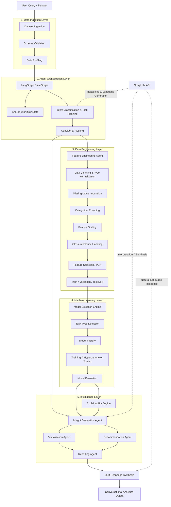
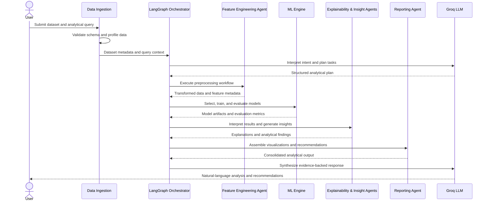

# Data Explainator

### Agentic Data Analytics, Machine Learning & Decision Intelligence Platform

<p align="center">
  <strong>From raw data to explainable insights and actionable recommendations.</strong>
</p>

Data Explainator is an AI-powered analytics platform that combines **LLM-driven reasoning, LangGraph-based agent orchestration, automated data engineering, machine learning, and explainable AI** into a unified workflow.

The platform transforms raw, heterogeneous datasets into structured analytical outputs by automating data profiling, preprocessing, feature engineering, model selection, evaluation, visualization, statistical interpretation, and recommendation generation.

Rather than treating data analysis as a collection of disconnected scripts, Data Explainator uses a stateful, multi-agent architecture in which specialized agents collaborate through a shared execution context to complete analytical tasks.

## Core Capabilities

<table>
  <tr>
    <td width="50%">
      <h3>Automated Data Engineering</h3>
      Dataset profiling, missing-value treatment, type inference, categorical encoding, feature scaling, outlier analysis, and class-imbalance handling.
    </td>
    <td width="50%">
      <h3>Agentic Orchestration</h3>
      LangGraph-driven execution, task planning, state transitions, conditional routing, and coordinated analytical workflows.
    </td>
  </tr>
  <tr>
    <td width="50%">
      <h3>Adaptive Machine Learning</h3>
      Problem-type detection, model selection, feature selection, training, hyperparameter optimization, and comparative evaluation.
    </td>
    <td width="50%">
      <h3>Explainable AI</h3>
      Feature attribution, model interpretation, prediction explanations, and identification of important patterns in the data.
    </td>
  </tr>
  <tr>
    <td width="50%">
      <h3>Intelligent Analytics</h3>
      Descriptive, diagnostic, predictive, and prescriptive analysis driven by natural-language queries.
    </td>
    <td width="50%">
      <h3>Decision Intelligence</h3>
      Automated visualizations, evidence-backed insights, actionable recommendations, and analytical reporting.
    </td>
  </tr>
</table>

## System Architecture

The system is organized into logical layers that separate data ingestion, agent orchestration, analytical execution, model evaluation, and response generation.



### Architecture Design Principles

* **Separation of concerns:** Data preparation, model execution, interpretation, and response synthesis operate as distinct responsibilities.
* **Stateful orchestration:** LangGraph manages workflow progression and passes structured context between agents.
* **Conditional execution:** The workflow can route analytical requests according to user intent and dataset characteristics.
* **Model-agnostic execution:** A model factory allows supported estimators to be selected according to the analytical task.
* **Evidence-backed generation:** Analytical explanations should be grounded in computed metrics, model outputs, and dataset statistics rather than generated from language-model reasoning alone.
* **Extensibility:** New analytical agents and model implementations can be integrated without redesigning the entire pipeline.

## Low-Level Design

### 1. Data Ingestion & Profiling

The ingestion layer establishes the analytical context before model execution.

Responsibilities include:

* Dataset loading and schema inspection.
* Column-type inference and normalization.
* Missingness, cardinality, distribution, and duplicate analysis.
* Target-column identification when applicable.
* Detection of numerical, categorical, and potential identifier features.
* Generation of a structured dataset profile for downstream agents.

**Output:** A validated dataset, metadata, profiling statistics, and an initial analytical context.

### 2. Agent Orchestration & State Management

The orchestration layer uses LangGraph to represent the analytical process as a directed state graph.

The workflow state acts as the shared context for the agents and can contain:

* User query and detected analytical intent.
* Dataset metadata and profiling results.
* Preprocessing configuration and transformation metadata.
* Feature lists and target definitions.
* Model configurations, trained estimators, and evaluation metrics.
* Explainability outputs, visualizations, and generated insights.
* Execution status, errors, and intermediate results.

The planning agent converts the user request into an execution plan. Conditional edges route the request to the appropriate analytical stages, while state updates allow downstream agents to consume earlier results.

### 3. Feature Engineering & Data Processing

The feature engineering agent constructs a preprocessing pipeline based on dataset characteristics and the selected problem type.

| Component                | Responsibility                                                                |
| ------------------------ | ----------------------------------------------------------------------------- |
| Data cleaning            | Normalize data types, handle duplicates, and identify invalid values          |
| Missing-value handling   | Apply appropriate imputation strategies                                       |
| Categorical encoding     | Convert categorical variables into model-compatible representations           |
| Feature scaling          | Apply scaling where required by the selected algorithm                        |
| Class balancing          | Apply techniques such as SMOTE when appropriate for imbalanced classification |
| Feature selection        | Identify relevant predictors and reduce unnecessary dimensionality            |
| Dimensionality reduction | Apply PCA when suitable for the analytical objective                          |
| Data splitting           | Establish training, validation, and test partitions                           |

Preprocessing transformations should be fitted on training data and then applied to validation and test data to prevent data leakage. Target leakage, identifier features, and inappropriate transformations must also be considered during pipeline construction.

**Output:** A model-ready dataset, transformation metadata, selected features, and a reproducible preprocessing configuration.

### 4. Machine Learning & Model Evaluation

The model execution layer selects and evaluates candidate estimators according to the task type and dataset characteristics.

Supported model families include:

* Random Forest
* XGBoost
* LightGBM
* CatBoost
* Other compatible Scikit-learn estimators

The model factory abstracts estimator construction, while the evaluation engine compares candidate models using appropriate metrics.

| Problem type              | Example evaluation metrics                             |
| ------------------------- | ------------------------------------------------------ |
| Classification            | Accuracy, precision, recall, F1-score, ROC-AUC         |
| Regression                | MAE, RMSE, R²                                          |
| Imbalanced classification | Precision-recall analysis, class-wise recall, F1-score |

The system can retain the selected model, evaluation results, and associated preprocessing configuration for subsequent prediction and interpretation.

### 5. Explainability & Insight Generation

The explainability layer connects model outputs with interpretable evidence.

Its responsibilities include:

* Identifying influential features.
* Explaining model predictions using feature-attribution techniques such as SHAP, where supported.
* Comparing feature importance across models.
* Highlighting relevant correlations, distributions, and segment-level patterns.
* Translating quantitative findings into understandable analytical summaries.

The insight generation agent combines dataset statistics, evaluation metrics, and explainability outputs to produce descriptive, diagnostic, and predictive findings. Prescriptive recommendations are derived from those findings and the business objective, with assumptions and limitations made explicit.

### 6. Visualization, Recommendations & Reporting

The final analytical layer turns intermediate results into decision-support outputs.

* **Visualization Agent:** Produces suitable charts and graphical summaries for important trends, distributions, relationships, and model results.
* **Recommendation Agent:** Converts identified patterns into potential actions aligned with the user's objective.
* **Reporting Agent:** Consolidates metrics, visualizations, explanations, and recommendations into a coherent analytical report.
* **Response Synthesis:** Uses the Groq-hosted LLM to explain the findings in natural language while retaining the distinction between computed results and generated interpretation.

## End-to-End Execution Flow



## Technology Stack

| Technology   | Role                                                                |
| ------------ | ------------------------------------------------------------------- |
| Python       | Core analytics and backend logic                                    |
| LangGraph    | Stateful agent orchestration and conditional workflow execution     |
| Groq API     | LLM inference for planning, interpretation, and response generation |
| Pandas       | Tabular data manipulation and profiling                             |
| NumPy        | Numerical computation                                               |
| Scikit-learn | Preprocessing, model training, evaluation, and pipeline utilities   |
| XGBoost      | Gradient-boosted decision trees                                     |
| LightGBM     | Efficient gradient-boosting models                                  |
| CatBoost     | Gradient boosting with categorical-feature support                  |
| SHAP         | Model explainability and feature attribution, where integrated      |

## Example Application: Customer Churn Analysis

Given a customer dataset, Data Explainator can execute a complete analytical workflow:

1. Profile customer attributes, data quality, missingness, and target distribution.
2. Identify the churn prediction task and determine relevant preprocessing steps.
3. Prepare features and address class imbalance when justified.
4. Train and compare candidate classification models.
5. Evaluate model performance using metrics appropriate to churn detection.
6. Identify influential churn predictors and explain model outputs.
7. Visualize customer patterns and generate potential retention recommendations.
8. Deliver a consolidated report through a natural-language interface.

The same architectural pattern can be adapted to other structured-data use cases, including sales forecasting, risk analysis, customer segmentation, and operational analytics.

## Project Roadmap

### Remaining Work

* [ ] **Frontend Development:** Build a user-facing interface for dataset uploads, conversational queries, workflow progress, interactive visualizations, model comparisons, and analytical reports.
* [ ] **Deployment & Productionization:** Deploy the application and supporting services, configure secrets and environment variables, and establish production monitoring, logging, and error handling.

The core analytics and agentic workflow is designed to support these final delivery stages.

## Getting Started

### Prerequisites

* Python environment compatible with the project's dependencies.
* Groq API key, if required by the configured LLM integration.
* Git.

### Installation

```bash
git clone https://github.com/AryanKKate/Data-Explainator.git
cd Data-Explainator

python -m venv venv
```

Activate the environment.

**Windows PowerShell**

```powershell
.\venv\Scripts\Activate.ps1
```

**macOS / Linux**

```bash
source venv/bin/activate
```

Install dependencies if the repository includes a `requirements.txt` file:

```bash
pip install -r requirements.txt
```

Configure the API key in your environment rather than hardcoding credentials:

**Windows PowerShell**

```powershell
$env:GROQ_API_KEY="your_api_key"
```

**macOS / Linux**

```bash
export GROQ_API_KEY="your_api_key"
```

Start the application using the entry point configured in the repository. The exact command depends on the current backend implementation.

## Future Vision

Data Explainator aims to bridge the gap between conventional data science tooling and AI-assisted decision intelligence. By coordinating data engineering, predictive modeling, explainability, and recommendation generation in a single workflow, the platform seeks to make complex analytics more accessible, repeatable, and actionable.

## Author

**Aryan Kate**

[GitHub](https://github.com/AryanKKate) · [Project Repository](https://github.com/AryanKKate/Data-Explainator)
